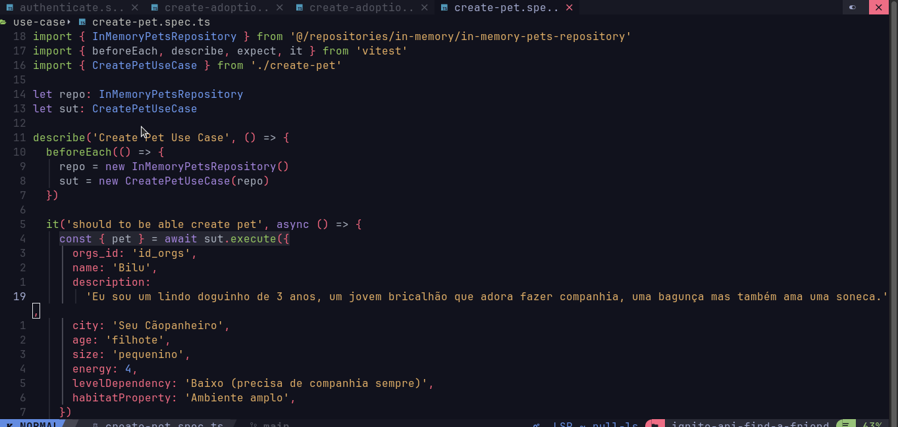

<h2 align="center">
  <div>
    
  </div>
</h2>

<h1 align="center">
  API Node.js SOLID | Find a Friend API REST 💻🚀 
 <h1>

<h1 align="center">
  <div style="display: flex; flex-direction: row;">
    
  </div>
</h1>

O desafio do ignite foi criar "Find a Friend" é uma API Rest que facilita a adoção de cães e gatos em qualquer cidade. Conectando usuários a organizações, com filtros por espécie, idade, tamanho, energia e localização. API tem o intuito de torna a experiência de adoção de um novo membro da família peludo mais acessível.

<h2 id="technologies"> 🛠 Tecnologias utilizadas: </h2>

  - `prisma`: ORM para banco de dados.
  - `supertest`: Testes de API.
  - `tsup`: Compilação TypeScript.
  - `tsx`: Suporte para TSX.
  - `typescript`: Linguagem de programação.
  - `vitest`: Ferramenta de teste.
  - `fastify`: Framework web (Fastify).
  - `zod`: Validação de dados (Zod).

<h2 id="usage" > 👷 Requisitos </h2>

Install git, node and yarn (or npm).

```bash
# Clone Repository
$ git clone https://github.com/franciniltonsoaresmenzes/ignite-api-find-a-friend.git

# Go to server folder
$ cd ignite-api-find-a-friend 

# Install Dependencies
$ npm install


# rename file .env.example to .env

# run docker compose
$ docker compose up -d

# run prisma
$ npx prisma migrate dev

# Run Tests
$ npm run test
$ npm run test:e2e
```

# Regras da aplicação

- [x] Deve ser possível cadastrar um pet
- [x] Deve ser possível listar todos os pets disponíveis para adoção em uma cidade
- [x] Deve ser possível filtrar pets por suas características
- [x] Deve ser possível visualizar detalhes de um pet para adoção
- [x] Deve ser possível se cadastrar como uma ORG
- [x] Deve ser possível realizar login como uma ORG

# Regras de negócio

- [x] Para listar os pets, obrigatoriamente precisamos informar a cidade
- [x] Uma ORG precisa ter um endereço e um número de WhatsApp
- [x] Um pet deve estar ligado a uma ORG
- [x] O usuário que quer adotar, entrará em contato com a ORG via WhatsApp
- [x] Todos os filtros, além da cidade, são opcionais
- [x] Para uma ORG acessar a aplicação como admin, ela precisa estar logada
